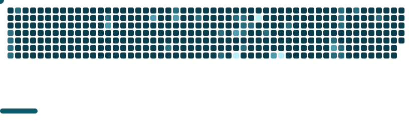

<h1 align="center">Hi there 🐧</h1>

* 📚 Curious mind with endless interest in tech, learning and growing
* 💻 Enjoy programming and exploring new things.
*  Vietnamese citizen, learning **Cybersecurity**.
* 🎮 Love tech, games, and creating content!
* 🌐 Languages: Vietnamese, English, Japanese (Learning)

 

  <ul style="list-style: none">
    

      <h2>🟢 Status</h2>
    

  </ul>

---
<picture>
  
</picture>

---

  

 
<h2>📈 GitHub Stats</h2>

    

