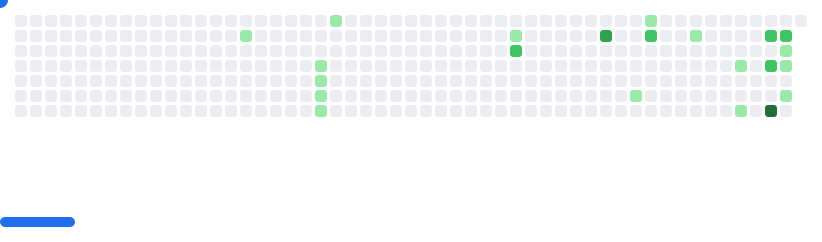

<h1 align="center">Hi chat 🐧</h1>

* 💻 Enjoy programming and exploring new things.
*  Vietnamese citizen, learning **Cybersecurity**.
* 🎮 Love tech, games, and creating content!
* 🌐 **Languages:**
    * 🇻🇳 Vietnamese (Native)
    * 🇬🇧 English (Understand but speak...maybe)
    * 🇯🇵 Japanese (Learning but kinda lazy ‎꜀( ꜆-ࡇ-)꜆)

 

  <ul style="list-style: none">
    

      <h2>🌙 Status</h2>
    

  </ul>

---
<picture>
  <source media="(prefers-color-scheme: dark)" srcset="images/breakout-dark.svg" />
  <source media="(prefers-color-scheme: light)" srcset="images/breakout-light.svg" />
  
</picture>

---

  

  

---

<a href="https[://discordapp.com/users/your-user-id](https://discordapp.com/users/your-user-id)" target="_blank">
  
</a>
<a href="https://www.linkedin.com/in/your-username" target="_blank">
  
</a>

---

  

